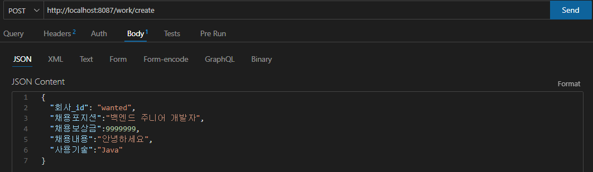

# 원티드 백엔드 인턴쉽 선발과제

[프리온보딩 백엔드 인턴십 선발과제](https://www.notion.so/1850bca26fda4e0ca1410df270c03409?pvs=21) 

# 사용 언어 및 프레임 워크 및 환경

### Java & Spring Boot

### MariaDB

### JBA
 
 

---

# 요구상황 분석 및 구현과정

### 1. 채용공고를 등록합니다.

 

 POST 메소드로 채용공고 등록을 합니다.

 
 
 

@RequestBody로 Json을 자바객체로 받아서, WorkCreateDTO에 담았습니다.

데이터 검증을 위해서 @Valid, BindingResult를 이용했습니다.

WorkController.java

 
 
 

@NotBlank를 통해 필드에 null과 “” , “ “이 들어오면 message 보냅니다.

@NotNull은 null만 제한합니다.

Setter보다 안정성을 위해 @Builder를 이용하여 Entity에 값을 넘겨주었습니다.(모든문제포함)

WorkCreateDTO.java

 
 
 

채용내용과 채용포지션을 빼고 보냈을때 검증에 걸려서 메시지와 Bad Requst를 retrun 합니다.

 
 
 

검증을 마친 후  WorkService에서 DTO → Entity 넘겨주 레포지토리를 통해 채용공고 등록

WorkService.java

 
 
 

채용공고가 등록된 모습

 
 
 

### 2. 채용공고를 수정합니다.

회사는  채용공고를 수정합니다. (회사 id 이외 모두 수정 가능합니다.)

 

PATCH 메소드를 이용해서 채용내용과 사용기술를 바꿉니다.

 
 
 

@PathVariable로 채용공고_id를 받아오고, Json을 WorkUpdateDTO로 받아옵니다.

WorkController.java

 
 
 

JpaRepository는 save()를 통해 INSERT와 UPDATE가 되므로, 채용공고id가 있는지 확인합니다.

 
 
 

회사id변경 방지를 위해 DTO에 회사id가 담겨있으면 에러를 뛰웁니다.

 
 
 

채용공고id가 존재 확인할때 받은 WorkEntity 데이터와 메소드로 받은 WorkUpdate DTO를 보내줍니다.

그리고 save()를 통해 업데이트를 합니다.

WorkService.java

 
 
 

기존 WorkEntity값에 WorkUpdateDTO에 들어온 각각의 값이 null이 아닐때, 덮어줬습니다.

WorkEntity.java

 
 
 

입력된 값만 수정이 완료 됬습니다.

 
 
 

### 3. 채용공고를 삭제합니다.

DELETE 메소드를 요청합니다.

 
 
 

채용공고id를 통해 존재하는지 확인하여 에러 처리합니다.

WorkController.java

 
 
 

채용공고id를 통해 해당 데이터를 삭제 했습니다.

WorkService.java

 
 
 

 
 
 

### 4. 채용공로 목록을 가져옵니다.

4-1. 사용자는 채용공고 목록을 확인할 수 있습니다.

 

GET 메소드를 요청합니다.

 
 
 

Entity에 있는 채용내용 필드를 뺀 WorkSelectDTO에 담았습니다.

WorkController.java

 
 
 

WorkService.java

 
 
 

Repository에서 @Query를 통해 채용내용은 조회안되게 받았습니다.(추후 상세페이지에서 조회가능)

WorkRepository.java

 

WorkSelectDTO.java

 

 
 
 

4-2. 채용공고 검색 기능 구현**(선택사항 및 가산점요소)**

 

검색 기능은 search라는 파라미터를 받아 Service에 전달합니다.

WorkController.java

 
 
 

전체 조회에서 만들었던 Repository에서 전체목록을 받아왔습니다.

foreach를 통해 각각의 검색결과 문자열을 합쳐, 대문자로변환하여 contains로 검색되게 하였습니다.

WorkService.java

 
 
 

 
 
 

### 5. **채용 상세 페이지를 가져옵니다.**

사용자는 채용상세 페이지를 확인할 수 있습니다.

- “채용내용”이 추가적으로 담겨있음.
- 해당 회사가 올린 다른 채용공고 가 추가적으로 포함됩니다**(선택사항 및 가산점요소).**

 
 

채용공고_id = 6을 상세페이지를 조회합니다.

 
 
 

기존에 채용공고_id 조회를 통해 findById를 통해 Entity에 있는 모든 필드를 조회합니다.

WorkController.java

 

WorkService.java

 
 
 

위에서 받아온 회사_id를 가져와 쿼리문을 통해 채용공고_id를 조회합니다.

WorkService.java

 

WorkRepository.java

 
 
 

Entity에서 DetaioDTO로 회사가올린다른채용공고과 함께 넘겨주었습니다.

WorkEntity.java

 

WorkDetailDTO.java

 
 
 

채용내용과 회사가올린다른채용공고까지 올라온걸 확인 할 수 있습니다.

 
 
 

### 6. **사용자는 채용공고에 지원합니다(선택사항 및 가산점요소).**

 사용자는 채용공고에 지원합니다. (가점 요소이며, 필수 구현 요소가 아님)

- 사용자는 1회만 지원 가능합니다.

 

아래와 같이 채용공고에 지원합니다.

 
 
 

채용공고 등록할때랑 마찬가지로 Null, 빈열 처리했습니다.

그후 WorkService에서 만들어놓은 findById를 통해 채용공고가 지원하는지 존재 유무 확인합니다.

ApplyController.java

 
 
 

ApplyEntity.java

 
 
 

Repository save를 통해 INSERT 되었고, Entity를 반환하여 보여줍니다

ApplyService.java

 

 
 
 

중복지원 방지는 쿼리문을 통해 사용자id, 채용공고id를 AND 조회하여 COUNT했습니다.

결과값이 0보다 클때, 지원이 되도록 하였습니다.

ApplyRepository.java
